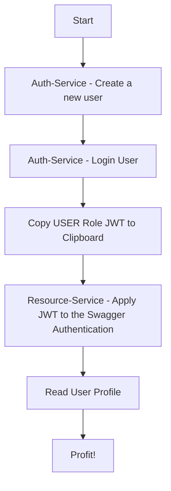

# JWT Authentication 

This project is a demo of how JWT based authorisation and authentication works.
The demo is split into 2 modules:
## auth-server
This is the component responsible for handling user registration and logins.  
When a user logs in, they are given a USER role JWT.  
This can be used to interact with the resource-server to retrieve the user's profile.
A user with a USER role JWT can only access their profile, nobody else's.  

The auth-server uses a PRIVILEGED role JWT to get the resource-server to store the user's profile when they register.

The auth-server maintains its own H2 database with the user credentials in.

## resource-server
This is the component responsible for maintaining the H2 database containing the user's profile data.
It exposes a CREATE PROFILE endpoint for the auth-service to use and a READ PROFILE endpoint for the user to use.  
Interaction with either endpoint requires a valid JWT.  
CREATE needs a PRIVILEGED token and READ needs a USER token.

## Using the Demo
This demo exposes the two services over HTTP.  
Each has their respective swagger pages.  
You can spin it all up using this command in a shell:  
`./gradlew spotlessApply cleanAll buildAll && docker-compose up --build`

Then use these links to access the swagger pages:
- [auth-service](http://localhost:8081/swagger-ui/index.html)
- [resource-service](http://localhost:8082/swagger-ui/index.html)

The flow is:

